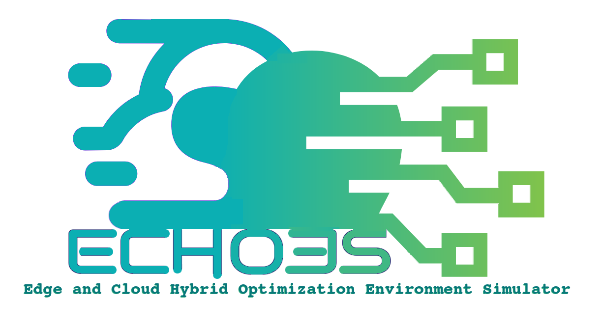

# ECHOES



Edge and Cloud Hybrid Optimization Environment Simulator (ECHOES)

## What is ECHOES?

ECHOES stand for **Edge and Cloud Hybrid Optimization Environment Simulator**, which is a free and open-source tool to simulate an Edge/Cloud-Hybrid network topology, in order to optimise and test methods for offloading Tasks from user's device to edge-server of cloud-server.


## Installation

### 1-Install Requirements
* **PHP**,
* **python** and **PIP**,
* **[Mknapsack](https://github.com/jmyrberg/mknapsack)**, Install with `pip install mknapsack`
```shell
pip install mknapsack
```
### 2-Install ECHOES
```shell
git clone https://github.com/TadavomnisT/ECHOES.git
```
____________________________________________________________

### Installation and Running example on Debian
```shell
pip install mknapsack
git clone https://github.com/TadavomnisT/ECHOES.git
cd ECHOES
php src/ECHOES.php
```


## Usage

```shell
cd ECHOES
php src/ECHOES.php
```

## Note

* There requirement for python will be no needed in future versions as I am re-implementing Knapsack module with PHP.
* Furture documents and explanations will be added soon.

## Author 

* Behrad.B(TadavomnisT) (behroora@yahoo.com)

## Lisense

* GPLv3+
